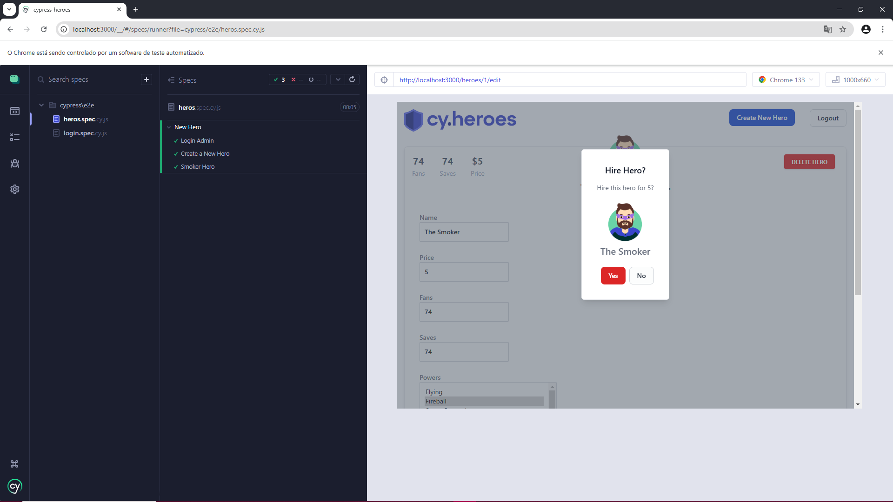

# Automação Cypress Heroes em JavaScript 




Projeto Cypress Heroes onde os usuários podem se registrar , fazer o login e realizar diversas ações. 
Estratégias de automação desenvolvidas para testar o sistema de ponta a ponta  com estruturas reutilizáveis, garantindo eficiência e qualidade.

> **💡 NOTA:**
> Acesse na pasta **cypress** depois em **e2e** e **Pages** dentro de **e2e** estão os specs deste projeto todos estão no formato **JSON** em js.
>  

## 📝 Passo a Passo para Instalação


**1.** **Clone o repositório na sua maquina 🖥️**

```bash
git clone https://github.com/ElizabethGomes-QAEngineer/Cypress-Heroes.git
```

**2.** **Navegue até o diretório do projeto 📂**

```bash
cd cypress-heroes
````

**3.** **Instale as dependências do projeto 📦**

```bash
npm install 
```

**4.** **Configuração de Ambiente 📦**

```bash
npm run setup
```

**5.** **Inicie o servidor de Desenvolvimento 📦**

```bash
npm run dev
```

**6.** **Abra outro Terminal e Execute o Cypress para rodar os testes 🚀**

abrir o Cypress com interface gráfica (GUI - Graphical User Interface)

```bash
npx cypress open
````


>
>**📜 ** **Nota** Este Projeto é acessivel em http://localhost:3000.
>
